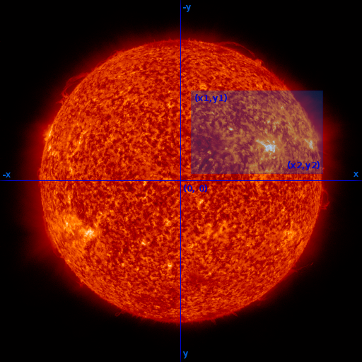
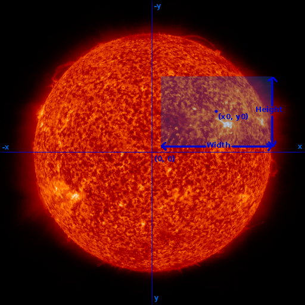

Coordinates
===========

The APIs for creating custom movies ('queueMovie') and screenshot images
('takeScreenshot') require that you specify a rectangular region-of-interest
(ROI). The ROI defines the field-of-view of the video or image in terms of a
zoom level and the location and size of the region.

The region-of-interest may be defined in either of two ways. Both methods
require an 'imageScale' expressed in arc-seconds per pixel, and atleast one
pair of X- and Y-coordinates (expressed as arc-seconds from the center of the
solar disk).

The first method defines the ROI based on a pair parameters specifying the X-
and Y-coordinates for the top-left ('x1','y1') and bottom-right ('x2','y2')
corners of rectangle.

An alternative method defines the ROI in terms of the X- and Y-coordinates of
the center of the region ('x0','y0'), coupled with the total width and height
of the rectangle in pixels. Use this method if the pixel dimensions of the
output are important to you. The APIs handle the translation between arc-seconds
and pixels based on the value of 'imageScale' that you have specified.

Smaller values of 'imageScale' will produce results that appear "zoomed-in" to
show more detail.

Below is a listing of the native image scales by datasource:

.. table:: Image Scales by Datasource

    +--------------------+---------------------+---------------------------------+
    |     Datasource     | Dimensions (pixels) | Image Scale (arc-seconds/pixel) |
    +====================+=====================+=================================+
    | PROBA2 SWAP        | 1024 x 1024         | 3.162                           |
    +--------------------+---------------------+---------------------------------+
    | SDO AIA            | 4096 x 4096         | 0.6                             |
    +--------------------+---------------------+---------------------------------+
    | SDO HMI            | 4096 x 4096         | 0.6                             |
    +--------------------+---------------------+---------------------------------+
    | SOHO EIT           | 1024 x 1024         | 2.63                            |
    +--------------------+---------------------+---------------------------------+
    | SOHO LASCO C2      | 1024 x 1024         | 11.9                            |
    +--------------------+---------------------+---------------------------------+
    | SOHO LASCO C3      | 1024 x 1024         | 56.0                            |
    +--------------------+---------------------+---------------------------------+
    | SOHO MDI           | 1024 x 1024         | 1.986                           |
    +--------------------+---------------------+---------------------------------+
    | STEREO SECCHI EUVI | 2048 x 2048         | 1.588                           |
    +--------------------+---------------------+---------------------------------+
    | STEREO SECCHI COR1 | 512 x 512           | 15.0                            |
    +--------------------+---------------------+---------------------------------+
    | STEREO SECCHI COR2 | 2048 x 2048         | 14.7                            |
    +--------------------+---------------------+---------------------------------+
    | Yohkoh SXT         | 1024 x 1024         | 2.46                            |
    +--------------------+---------------------+---------------------------------+

You are not limited to creating screenshots and movies at a datasource's native
resolution. Each image layer will be scaled to match the imageScale you have
requested.
